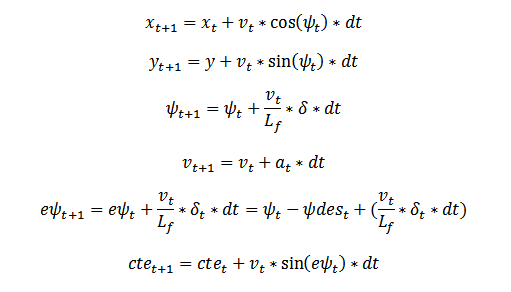

# CarND-Controls-MPC
Self-Driving Car Engineer Nanodegree Program

---

## Dependencies

* cmake >= 3.5
 * All OSes: [click here for installation instructions](https://cmake.org/install/)
* make >= 4.1
  * Linux: make is installed by default on most Linux distros
  * Mac: [install Xcode command line tools to get make](https://developer.apple.com/xcode/features/)
  * Windows: [Click here for installation instructions](http://gnuwin32.sourceforge.net/packages/make.htm)
* gcc/g++ >= 5.4
  * Linux: gcc / g++ is installed by default on most Linux distros
  * Mac: same deal as make - [install Xcode command line tools]((https://developer.apple.com/xcode/features/)
  * Windows: recommend using [MinGW](http://www.mingw.org/)
* [uWebSockets](https://github.com/uWebSockets/uWebSockets) == 0.14, but the master branch will probably work just fine
  * Follow the instructions in the [uWebSockets README](https://github.com/uWebSockets/uWebSockets/blob/master/README.md) to get setup for your platform. You can download the zip of the appropriate version from the [releases page](https://github.com/uWebSockets/uWebSockets/releases). Here's a link to the [v0.14 zip](https://github.com/uWebSockets/uWebSockets/archive/v0.14.0.zip).
  * If you have MacOS and have [Homebrew](https://brew.sh/) installed you can just run the ./install-mac.sh script to install this.
* [Ipopt](https://projects.coin-or.org/Ipopt)
  * Mac: `brew install ipopt --with-openblas`
  * Linux
    * You will need a version of Ipopt 3.12.1 or higher. The version available through `apt-get` is 3.11.x. If you can get that version to work great but if not there's a script `install_ipopt.sh` that will install Ipopt. You just need to download the source from the Ipopt [releases page](https://www.coin-or.org/download/source/Ipopt/) or the [Github releases](https://github.com/coin-or/Ipopt/releases) page.
    * Then call `install_ipopt.sh` with the source directory as the first argument, ex: `bash install_ipopt.sh Ipopt-3.12.1`. 
  * Windows: TODO. If you can use the Linux subsystem and follow the Linux instructions.
* [CppAD](https://www.coin-or.org/CppAD/)
  * Mac: `brew install cppad`
  * Linux `sudo apt-get install cppad` or equivalent.
  * Windows: TODO. If you can use the Linux subsystem and follow the Linux instructions.
* [Eigen](http://eigen.tuxfamily.org/index.php?title=Main_Page). This is already part of the repo so you shouldn't have to worry about it.
* Simulator. You can download these from the [releases tab](https://github.com/udacity/CarND-MPC-Project/releases).

## Basic Build Instructions

1. Clone this repo.
2. Make a build directory: `mkdir build && cd build`
3. Compile: `cmake .. && make`
4. Run it: `./mpc`.

## Tips

1. It's recommended to test the MPC on basic examples to see if your implementation behaves as desired. One possible example
is the vehicle starting offset of a straight line (reference). If the MPC implementation is correct, after some number of timesteps
(not too many) it should find and track the reference line.
2. The `lake_track_waypoints.csv` file has the waypoints of the lake track. You could use this to fit polynomials and points and see of how well your model tracks curve. NOTE: This file might be not completely in sync with the simulator so your solution should NOT depend on it.
3. For visualization this C++ [matplotlib wrapper](https://github.com/lava/matplotlib-cpp) could be helpful.

## Editor Settings

We've purposefully kept editor configuration files out of this repo in order to
keep it as simple and environment agnostic as possible. However, we recommend
using the following settings:

* indent using spaces
* set tab width to 2 spaces (keeps the matrices in source code aligned)

## Code Style

Please (do your best to) stick to [Google's C++ style guide](https://google.github.io/styleguide/cppguide.html).

## Project Instructions and Rubric

### The Model

The model used in this project is a kinematic model that is simplifications of dynamic models that ignore tire forces, gravity, and mass.The model describes the car state as [*x, y, &#936;, v, cte, e&#936;*]. The *x, y* are 2D cartesian coordinates of the car. *&#936;* is the orientation of the car heading to. *v* is car velocity, *cte* is cross-track error while *e&#936;* is the orientation error.

The car actuator inputs are [*&#948;, a*], where *&#948;* for steering angle and *a* for acceleration. With these two inputs, the kinematic model can be described with following equations:

Here *Lf* is the distance between the center of mass of the vehicle and the front wheels.

### Timestep Length and Elapsed Duration

The MPC prediction horizon *T* is the duration over which future predictions are made. It is determined by the number of timesteps in the horizon *N* and elapsed duration between timesteps *dt*. The *N* determines the number of variables the optimized by MPC. It is also the major driver of computational cost. A longer *dt* could result in less frequent actuations, which makes it harder to accurately approximate a continuous reference trajectory. But a shorter *dt* requires larger *N* for a fixed prediction horizon, thus increases computational cost.

Since our goal is to drive the car in about 50 miles per hour on the track, which is about 22 meters per second. We limit the prediction horizon to be about 10 meters, which means our prediction horizon is about 0.5 seconds. Beyond that, the track can change enough that it won't make sense to predict any futher into the future. We start test with reference velocity from 20 miles, and limit our searh of *N* from 10 - 15, *dt* from 0.025 - 0.75. We gradually increased reference velocity once we obtain a good result and adjust the values again for cureent velocity. Our final choices of *N* is 10, and *dt* is 0.5. These two values seem work well for reference velocity from 20 to 60 miles per hour. When velocity increae to higher than 80 miles per hour, it has high swing on the second turn after the bridge. 

### Polynomial Fitting and MPC Preprocessing

A polynomial is fitted to waypoints.

If the student preprocesses waypoints, the vehicle state, and/or actuators prior to the MPC procedure it is described.

### Model Predictive Control with Latency

The student implements Model Predictive Control that handles a 100 millisecond latency. Student provides details on how they deal with latency.

## Result and Reflection

Here is a [link](https://www.youtube.com/watch?v=9Wah9d0_8SA) to my final video output:

    

